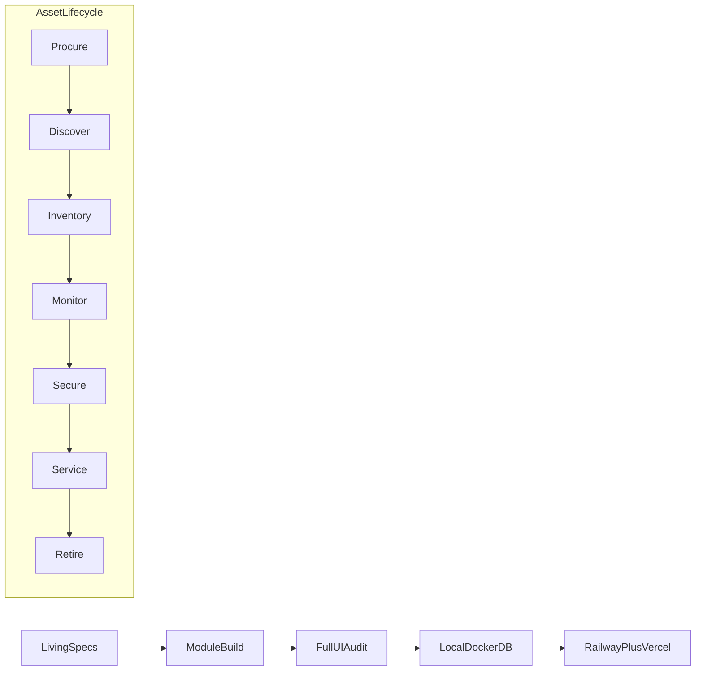

# QS Assets — Competitive Enterprise Build, Spec Rewrite, and Live Deploy

## Why the previous plan was insufficient

The prior draft treated ManageEngine/ServiceNow/Qualys parity as “multi-quarter” and **deferred** NetFlow, authenticated vuln depth, workflow UX, mobile, and RLS. That conflicts with your ask: **specs improved, whole app audited, every org-scale IT+non-IT flow made real, Docker + live Railway/Vercel**.

This plan does **not** claim a pixel-perfect clone of those vendors. It **does** commit to shipping **working, production-grade equivalents** of every capability an organization managing large mixed asset fleets needs — using the stack we already have (NestJS, Prisma, Node agent, Next.js, Docker, Railway, Vercel).

**North-star competitors (capability targets):**
- ManageEngine: AssetExplorer + Endpoint Central + OpManager + ServiceDesk Plus
- ServiceNow: ITAM / EAM / CMDB / ITSM
- Qualys: CyberSecurity Asset Management + VMDR-lite
- Ivanti Neurons / Asset Panda: autonomic ops + non-IT tracking UX

---

## Delivery principle

1. **Specs drive code** — rewrite specs first as living PRDs with acceptance tests; implementation must satisfy them.
2. **No mocks** — if a feature is in the UI, it hits real storage/APIs; if a dependency is missing (ffmpeg, WinRM, IdP), show an honest operational state, never fake inventory.
3. **Org lifecycle first** — every feature maps to procure → discover → inventory → monitor → secure/patch → service → retire.
4. **Scale defaults** — Postgres indexes, batch jobs, Redis queues, pagination, tenant isolation (app filters + Postgres RLS).

---

## Phase 0 — Living specs (all of `spec/`)

Rewrite every file. Product name **QS Assets** (NeurQ AI Labs). Keep competitive inspiration explicit.

| Deliverable | Content |
|-------------|---------|
| [`spec/00-SPEC-INDEX.md`](spec/00-SPEC-INDEX.md) | Index, status, owners, last-reviewed, dependency order |
| [`01-PRODUCT-OVERVIEW.md`](spec/01-PRODUCT-OVERVIEW.md) | Full module catalog + **capability matrix** vs ME/SN/Qualys/Ivanti/AssetPanda (`Must-ship` / `Shipped` / `In-build`) — no vague “Roadmap” for Must-ship items |
| [`02-DISCOVERY-AND-SCANNING.md`](spec/02-DISCOVERY-AND-SCANNING.md) | As-built Node agent + Electron + MSI/PKG/DEB; WMI/SSH/SNMP/Nmap; AD; AWS/Azure/GCP; MQTT/ONVIF/Modbus/BACnet; correlation rules; acceptance tests |
| [`03-ARCHITECTURE-AND-TECH-STACK.md`](spec/03-ARCHITECTURE-AND-TECH-STACK.md) | As-built monorepo; EventBus+Socket.io; Redis jobs; PostGIS where used; **RLS required**; optional Kafka/GraphQL labeled future-only |
| [`04-SSDLC-COMPLIANCE-SECURITY.md`](spec/04-SSDLC-COMPLIANCE-SECURITY.md) | MFA/SAML/OIDC; audit hash-chain verify job; CIS evidence export; real CI gates |
| [`05-DATABASE-SCHEMA.md`](spec/05-DATABASE-SCHEMA.md) | Regenerated from Prisma after schema expansions (EAM, NetFlow, workflows, business services) |
| [`06-DASHBOARDS-API-DELIVERABLES.md`](spec/06-DASHBOARDS-API-DELIVERABLES.md) | All 8 role dashboards mapped to routes; complete REST catalog; deliverables checklist with pass/fail |
| [`07-GAP-REMEDIATION-PLAN.md`](spec/07-GAP-REMEDIATION-PLAN.md) | Historical Phase 1–5 = done; this document becomes the **execution tracker** for Phases 1–6 below |

Also add [`spec/08-ORG-FLOWS.md`](spec/08-ORG-FLOWS.md): end-to-end playbooks (onboard 10k assets, non-IT labeling, patch Tuesday, NOC incident, CAB change, employee self-service, multi-cloud inventory).

---

## Phase 1 — Platform foundation (Docker + data)

1. Start [`docker-compose.yml`](docker-compose.yml): PostGIS + Redis (+ Meilisearch for global search).
2. Fix [`apps/api/.env`](apps/api/.env) `DATABASE_URL`; expand [`.env.example`](apps/api/.env.example) for vault, Redis, NVD, payments, SSO, MQTT, NetFlow port, syslog port.
3. `prisma migrate deploy` + `generate` + `db:seed`.
4. Enable Redis-backed job queue for scans, NVD ingest, AD sync, NetFlow rollups (BullMQ or existing Bull).
5. Add Postgres **RLS policies** on tenant-scoped tables (`SET app.current_tenant` in Prisma middleware).
6. Smoke: API boot, migrate, login, create asset.

---

## Phase 2 — ITAM + EAM (AssetExplorer / ServiceNow / Asset Panda)

### ITAM
- Mass depreciation job + finance report (straight-line / declining).
- Checkout/check-in workflows + attestation campaigns (bulk assign, remind, certify).
- Software metering accuracy: last-used from agent; harvest recommendations actionable (ticket + reclaim).
- License blacklist/whitelist → agent enforce (`KILL_PROCESS` / block install).
- Relationship CMDB: impact analysis API (“what breaks if this CI goes down”) + UI graph drilldown.
- **Business services (CSDM-lite):** `BusinessService` model linking critical assets; dashboard health rollup.

### EAM (non-IT)
- Models: `MaintenanceSchedule`, `MaintenanceWorkOrder`, `SparePart`, `SparePartTransaction`, `Consumable` (reorder points).
- Condition-based + calendar PM; auto work-orders; spare consume + min-stock → AlertEvent.
- Site `floorPlanUrl` + asset pin `{x,y}` overlay UI on facility page.
- Barcode/QR already shipped — add RFID/NFC **tag ID field** + lookup (same `/scan` path).
- Facility Manager dashboard (spec dashboard #8) as real route widgets.

---

## Phase 3 — Discovery + UEM (Endpoint Central class)

- **AD/LDAP:** multi-OU computer/user sync (`ldapts`), vault credentials, schedule, conflict merge.
- **Cloud:** AWS EC2 (exists) + **Azure** Compute/Resource Graph + **GCP** Compute list — no stubs.
- **IoT/OT:** MQTT (exists) + Modbus TCP + BACnet/IP probe scanners behind feature flags, registered as assets.
- **Agent UEM:** remote script run (ScriptLibrary), software deploy rings (pilot → production), file pull of agent logs; remote assistance = documented RDP/SSH deep-link (no fake WebRTC unless Media server added).
- Discovery UI: **Desktop App / Service Installer / ZIP** tabs with real download endpoints or build artifacts.
- Agentless enrich always fills Hardware/OS when credentials succeed (no empty CMDB after successful WMI/SSH).

---

## Phase 4 — NMS (OpManager class)

- SNMP poll/traps (exists) + **syslog UDP ingest** → alerts + optional auto-ticket.
- **NetFlow/sFlow/IPFIX UDP collector:** parse to `FlowRecord` / rollup tables; Top Talkers + interface bandwidth charts (real packets only; empty until exporters configured).
- Config management: backup versions, baseline diff, drift alerts, approve+push where SSH/vendor allows.
- LLDP/CDP neighbor enrichment into topology.
- NOC dashboard route: topology + alarm list + top interfaces + trap/syslog stream.

---

## Phase 5 — Patch + Vulnerability (Endpoint Central + Qualys CSAM/VMDR-lite)

- Live third-party catalogs: winget REST + apt/brew metadata sync (hundreds of packages, not hardcoded tens).
- Deploy policies: **pilot ring → staged → all**; schedule windows; **rollback** UI calling agent uninstall/previous package.
- Air-gap: export/import patch bundle ZIP for offline tenants.
- Vuln: NVD ingest (exists) + **agent authenticated scan** (collect products/versions → CVE match); critical auto-ticket; risk score CVE-primary.
- CIS benchmark evidence packs: agent/SSH collectors → compliance report PDF/CSV.

---

## Phase 6 — ITSM (ServiceDesk Plus / ServiceNow-lite)

- Change: multi-level approval, CAB calendar, SSDLC **9-step change type** with mandatory gates (UAT/VAPT checklist fields + evidence attachments).
- SLA escalation cron → notify + reassign.
- CSAT survey on ticket resolve.
- Visual-ish **workflow rules builder** UI over AutomationRule (trigger/condition/action form, not full canvas — but complete and usable).
- Omnichannel: inbound email → ticket (IMAP poll); Slack/Teams already outbound.
- Service catalog approvals enforced before fulfillment.
- Knowledge base linked from ticket suggest.

---

## Phase 7 — Security, NAC, Auth

- MFA TOTP enroll/challenge on login.
- SAML 2.0 ACS (real assertion consumer) + OIDC + Google/MS; group→role map.
- Threat Approve/Quarantine/Block (exists) + WebSocket push to admins.
- NAC: persist policies (exists) + **RADIUS CoA / webhook to switch API** when RADIUS config enabled; quarantine still works via agent firewall if CoA unavailable.
- Audit: nightly hash-chain verify job; SIEM syslog/webhook export.

---

## Phase 8 — Fleet, CCTV, VDI, Reports

- Fleet: geofence entry/exit, speeding, idle alerts; Traccar protocol ingest endpoint; maintenance due from EAM schedules.
- CCTV: HLS (exists) + multi-camera **video wall** layout; tamper/offline alerts.
- VDI: console launch (exists) + session metrics poll (Horizon/Proxmox) into charts.
- Reports: parameterized report runner + **schedule email PDF/XLSX**; custom report from saved filters (not a full BI tool — query builder on assets/tickets/vulns).
- Meilisearch-backed Cmd+K global search across assets, tickets, users, CIs.

---

## Phase 9 — Full UI/UX audit and role dashboards

Walk **every** route under [`apps/web/src/app`](apps/web/src/app):
- Fix empty/broken wiring; remove “Coming soon” where backend exists.
- Implement Executive / IT Admin / NOC / Fleet / Service Desk / Security / Facility / Portal dashboards from spec 06 (compose existing APIs).
- Design system: PageHeader/EmptyState everywhere; landing already redesigned — keep consistency.
- PWA meta for `/scan` (installable barcode scanner on phones).
- Module gating consistent with tenant plan.

---

## Phase 10 — Verify + live deploy

### Verify
- `tsc` API + web; critical unit tests for discovery enrich, CVE match, NetFlow parse, MFA login.
- E2E smoke script: health, auth, asset CRUD, scan job, QR lookup, vuln ingest dry-run, checkout.

### Deploy
1. `railway login` (currently unauthorized) → link existing project → set env → `prisma migrate deploy` → redeploy API (`apps/api` Dockerfile / railway.json).
2. Vercel: set `NEXT_PUBLIC_API_URL`, CORS on API, OAuth redirect URIs → `vercel --prod` for `apps/web`.
3. Write [`DEPLOY.md`](DEPLOY.md) runbook (no secrets).
4. Post-deploy production checklist: `/health`, login, agent download, one agentless scan against allowed range.

---

## Competitive coverage matrix (Must-ship in this plan)

| Capability | Competitor analog | Implementation approach |
|------------|-------------------|-------------------------|
| CMDB + lifecycle + finance | AssetExplorer / SN ITAM | Assets + depreciation jobs + relationships + business services |
| Non-IT PM + spares + floor pins | Asset Panda / SN EAM | EAM module + facility UI |
| Agent + agentless + AD + cloud | Endpoint Central / Qualys CSAM | Existing scanners + AD + Azure/GCP |
| Patch rings + rollback + catalog | Patch Manager Plus | Agent deploy + winget/apt catalogs |
| CVE risk + tickets | Qualys VMDR-lite | NVD + agent inventory match + auto-ticket |
| SNMP + syslog + NetFlow top talkers | OpManager | Collectors + rollups + NOC UI |
| Tickets + CAB + SLA + catalog | ServiceDesk Plus | Extend changes/tickets/automation |
| MFA + SAML + RLS | Enterprise baseline | TOTP + passport-saml + Prisma RLS |
| Fleet GPS + geofence | Fleet vendors / ME | Existing GPS + alert rules |
| CCTV wall | OpManager/camera suites | HLS + wall layout |
| Always-on agent | AV-like endpoint | Electron + native services (already started) |

---

## Acceptance criteria (launch)

- Specs are accurate living PRDs; every Must-ship row has a passing acceptance test or demo path.
- Docker Postgres/Redis healthy; all migrations applied; seed works.
- Org can: discover  (agentless+agent+AD+cloud), label non-IT (QR), run PM/spares, monitor network (SNMP+syslog+flows when exporters exist), patch with rings, triage CVEs, run ITSM with CAB, enforce MFA/SAML, see role dashboards.
- No stubbed Azure/SAML/syslog/license-tab/automation-default-agent left.
- Production Railway API + Vercel web redeployed and healthy with correct CORS/OAuth.

---

## Explicit non-goals (only these)

- Replacing Qualys’ proprietary vuln signature engine or ME’s full proprietary patch research lab.
- Building a general-purpose Flow Designer canvas equal to ServiceNow IntegrationHub.
- App-store notarization without customer code-signing certificates (packaging scripts + Electron builds still ship).
- Rewriting the agent in Go (Node agent is the permanent as-built choice unless a future ADR reverses it).
