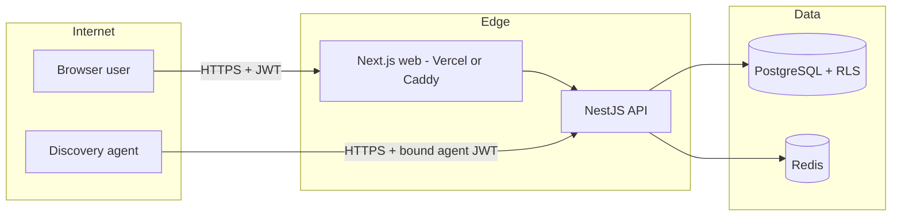

# QS Assets — Threat Model (STRIDE)

Scope: SaaS deployment (Vercel web + Railway API/Postgres/Redis) and the
on-prem appliance (Docker Compose behind Caddy). Endpoint discovery agents run
on customer machines. Last reviewed: 2026-07-19.

## System decomposition and trust boundaries

Trust boundaries: browser↔web, agent↔API, API↔DB (tenant GUC / RLS),
SaaS issuer↔on-prem install (signed license files), release channel↔appliance
(signed manifests).

## STRIDE analysis

### Spoofing
| Threat | Mitigation | Status |
|---|---|---|
| Credential stuffing on login | Throttling, lockout persistence, MFA (TOTP), tenant MFA enforcement | Shipped |
| Agent impersonating another agent | Per-agent `AgentEnrollment`, `agentId`-bound 7-day JWTs, path-id match on heartbeat/script/file endpoints | Shipped |
| Forged license files | Ed25519 signature over canonical payload; fingerprint + installId + nonce binding | Shipped |
| Forged platform/agent updates | Separate Ed25519 keys per channel; manifest checksum + signature verified before apply | Shipped |
| SSO assertion spoofing | SAML ACS tenant binding, OIDC state, issuer validation | Shipped |

### Tampering
| Threat | Mitigation | Status |
|---|---|---|
| Cross-tenant data modification | Postgres RLS + `withTenant` GUC scoping; tenant-scoped writes on agent command history | Shipped (hot paths); continue RLS expansion |
| Agent config tampering on endpoint | Windows ACL lockdown (SYSTEM+Administrators), no plaintext passwords persisted | Shipped |
| CI artifact tampering | Signed agent/platform releases; SBOM per build; gitleaks/Trivy/Semgrep in CI | Shipped |
| Container escape / privilege abuse | Non-root `qsasset` (UID 10001) in API/web images | Shipped |

### Repudiation
| Threat | Mitigation | Status |
|---|---|---|
| Admin denies destructive action | AuditLog with actor, IP, action, resource, outcome; owner console log view | Shipped |
| Agent denies data submission | Heartbeat + enrollment `lastUsedAt`, JTI-traceable tokens | Shipped |
| Missing tamper-evidence on logs | Immutable/external log shipping | Gap — planned (ship to SIEM) |

### Information disclosure
| Threat | Mitigation | Status |
|---|---|---|
| Secrets in API responses | Central redaction; `hasPassword`-style flags; regression specs | Shipped |
| Cross-tenant reads | RLS + guards; tenant-isolation specs | Shipped |
| Secrets in repo | CI secret guard + gitleaks; `.secrets/` gitignored | Shipped |
| Token theft via XSS (localStorage) | CSP hardening; HttpOnly cookie migration | Accepted risk, migration planned |
| DB backup exposure | Backups stay on customer appliance; document encryption-at-rest expectations | Partial — document in hardening guide |

### Denial of service
| Threat | Mitigation | Status |
|---|---|---|
| Login/contact flood | Per-IP+email throttles | Shipped |
| Agent ingest flood | Per-agent rate limits (replacing blanket skip-throttle) | Shipped |
| Queue/cron pileup | PROCESS_ROLE split, Redis-backed queues, HA compose | Shipped (single-node default) |
| UDP collector amplification | Collector role isolation; bind configuration | Shipped |

### Elevation of privilege
| Threat | Mitigation | Status |
|---|---|---|
| Agent role escalating to Tenant Admin | Fixed — agent role no longer elevates | Shipped |
| Employee reading internal ticket notes | Role checks + `isInternal` stripping | Shipped |
| Free-form remote shell abuse | ScriptLibrary allowlist, dual-approval for high-risk scripts | Shipped |
| FILE_PULL path traversal | Canonicalization + allowlist roots + secret-path blocklist | Shipped |
| SuperAdmin API exposure | `SuperAdminGuard` on all owner endpoints incl. platform updates | Shipped |

## Top residual risks (owner attention)

1. localStorage JWTs (XSS blast radius) — migrate to HttpOnly cookies.
2. No external/immutable audit log sink — CERT-In retention expects one.
3. No independent VAPT yet — required for bank/government procurement.
4. Single-region SaaS — DR depends on Railway/Vercel; runbook exists, drill pending.

Review cadence: re-run this model on any auth, licensing, agent-protocol, or
release-channel change, and at least quarterly.
