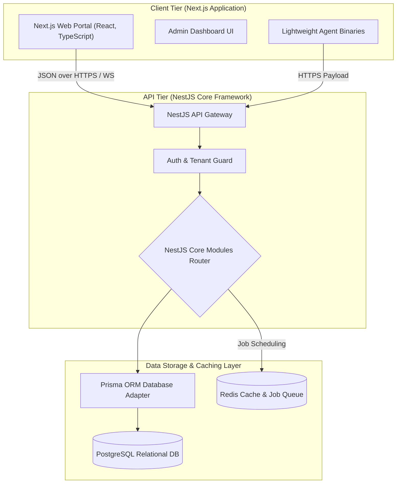

# Software Development Documentation: QS Assets

**Company:** NeurQ AI Labs Private Limited  
**Product:** QS Assets (ITAM & ITSM Enterprise Suite)  
**Document version:** 1.0.0  
**Target Audience:** Software Engineers, DevOps, Systems Architects, and Security Review Teams  

---

## 1. System Architecture & Tech Stack

QS Assets is engineered as a modern, high-performance monorepo utilizing **Turbo** to manage frontend and backend applications. The platform is designed to be deployed on-premises (fully air-gapped) or in secure cloud environments (AWS, Azure, GCP).



### Technical Stack Details
* **Frontend Portal (`apps/web`):** Built with **Next.js**, **React**, and **TypeScript**. Styled with CSS variables for dynamic theme customization.
* **Backend API (`apps/api`):** Developed on **NestJS**, a modular Node.js framework. It uses **TypeScript** and supports dependency injection, guards, interceptors, and decorators.
* **Database Adapter:** **Prisma ORM**, offering type-safe schema mapping, automated migrations, and transactional safety.
* **Primary Database:** **PostgreSQL** for relational schemas, keys, indices, and asset history logging.
* **Caching & Queue Controller:** **Redis** for managing scheduled background network sweeps, active alerts, and session caches.

---

## 2. Codebase Organization & Workspace Directories

QS Assets is managed as a monorepo workspace. Below is the directory layout:

```
/
├── apps/
│   ├── api/                   # NestJS Backend API Service
│   │   ├── prisma/            # Database schema and migrations
│   │   └── src/
│   │       ├── app.module.ts  # Main entry point for app modules
│   │       ├── main.ts        # Bootstraps API server
│   │       └── modules/       # 33 Core NestJS business modules
│   └── web/                   # Next.js Frontend Application
│       ├── src/
│       │   ├── app/           # App router page views and layouts
│       │   └── components/    # Reusable UI components
├── infra/                     # Infrastructure configuration and deployment files
├── package.json               # Root monorepo configuration
└── turbo.json                 # Turbo workspace builder tasks
```

---

## 3. NestJS Backend Modules Analysis

The backend API is built using NestJS modules. Located in `apps/api/src/modules`, each directory contains its own `module`, `controller`, `service`, and `dto` components:

| Module Name | Responsibility | Key Tables Relied On |
| :--- | :--- | :--- |
| **`auth` / `users` / `tenants`** | Handles user authentication, RBAC roles, tenant isolation, and API keys. | `User`, `Role`, `Tenant`, `ApiKey`, `RefreshToken` |
| **`assets` / `asset-types`** | Governs the Configuration Management Database (CMDB) structure and custom schemas. | `Asset`, `AssetType`, `AssetRelationship` |
| **`discovery` / `scanning`** | Controls agentless subnet sweeping, ping sweeps, SSH, WinRM, and WMI scanning. | `ScanJob`, `DiscoveredDevice`, `ScanCredential` |
| **`monitoring` / `alerts`** | Manages continuous endpoint health monitoring and user alerting channels. | `MonitoredDevice`, `Notification`, `NotificationChannel` |
| **`software` / `licenses`** | Tracks installed software catalogs, seat counts, keys, and software usage compliance. | `SoftwareCatalog`, `SoftwareInstallation`, `License` |
| **`tickets` / `work-orders`** | Powers the ITIL service desk ticket queues, comments, SLAs, and task work orders. | `Ticket`, `WorkOrder`, `TicketComment`, `SlaPolicy` |
| **`procurement`** | Oversees procurement, purchase orders, contracts, and vendor AMCs. | `Vendor`, `Contract`, `PurchaseOrder`, `PurchaseOrderItem` |
| **`fleet`** | Tracks GPS location telemetry and trip history for field vehicle assets. | `Trip`, `GpsTelemetry` |
| **`patches`** | Monitors operating system patch updates and vulnerability remediations. | `Patch`, `PatchDeployment` |
| **`problems` / `changes`** | Fulfill ITIL Problem Management and Change Request approval pipelines. | `Problem`, `ChangeRequest` |
| **`audit-logs`** | Automatically logs all user-driven administrative actions. | `AuditLog` |

---

## 4. Database Schema Structure & Key Relations

The relational database is defined in `apps/api/prisma/schema.prisma`. It tracks asset typologies, service desk tickets, software installations, and scan configurations.

### Key Database Models & Schema Diagram

#### 1. Core Asset Inventory Entity (`Asset`)
Contains fields for physical properties, networking coordinates, lease details, and hardware associations:
* **Unique Identification:** `id` (UUID), `assetTag` (Unique per tenant), `serialNumber`, `barcode`.
* **Relations:** Maps to `Tenant`, `AssetType`, `Site`, `Department`, `User` (assigned to / managed by), and `Vendor`.
* **Child Tables:** Relates to `HardwareDetail` (CPU/Memory specs), `OsDetail` (OS details), `SecurityPosture` (encryption/firewall status), `SoftwareInstallation`, `TicketAsset`, and `AssetCheckout`.

#### 2. Network Scanning Configuration (`ScanCredential` & `ScheduledScan`)
* `ScanCredential` stores credentials encrypted with AES-256-GCM.
* `ScheduledScan` maps target subnets (`NetworkConfig`), credential relationships, scan schedules, and results.

#### 3. ITIL Ticketing System (`Ticket` & `SlaPolicy`)
* `Ticket` links to multiple assets via the `TicketAsset` join table.
* `Ticket` tracks problem root causes via `Problem` relations, and modifications via `ChangeRequest` templates.
* `SlaPolicy` enforces response and resolution times, tracking SLA breach flags.

---

## 5. Setup & Development Environment Installation

Follow these steps to set up the development environment locally:

### Prerequisites
* **Node.js:** version 20+ (LTS)
* **Docker:** version 24+ & Docker Compose (for running PostgreSQL and Redis)
* **Package Manager:** npm (v10+)

### Step-by-Step Local Setup

1. **Clone the repository and install dependencies:**
   ```bash
   npm install
   ```

2. **Environment Configuration:**
   Copy the example environment files in both the API and Web applications:
   ```bash
   cp apps/api/.env.example apps/api/.env
   cp apps/web/.env.example apps/web/.env
   ```

3. **Start Local Services (PostgreSQL & Redis):**
   Use Docker Compose to run the required database and cache services:
   ```bash
   docker compose up -d
   ```

4. **Initialize Database Schema & Seeds:**
   Run Prisma migrations and apply test seed records to setup default tenants, roles, admin users, and asset types:
   ```bash
   cd apps/api
   npx prisma migrate dev
   npx prisma db seed
   ```

5. **Start Dev Server in Monorepo Workspace:**
   Return to the project root directory and run:
   ```bash
   cd ../..
   npm run dev
   ```
   * Next.js web portal: `http://localhost:3000`
   * NestJS API gateway: `http://localhost:5000`

---

## 6. Core System Workflows

### 1. Agentless Discovery Sweep Process
```
[ScheduledScan Trigger]
       │
       ▼
[Retrieve Decrypted ScanCredentials] ──► (WMI, SSH, SNMP Protocol Workers)
       │
       ▼
[Subnet Sweep Engine] ──► Sends ICMP Ping & TCP Port Scans
       │
       ▼
[Parse Device Details] ──► Hostname, MAC Address, Installed Hardware Details
       │
       ▼
[Upsert DiscoveredDevice Record]
       │
       ▼
[Verify and Flag Rogue Devices] (Flags if MAC/IP is unmapped in CMDB)
```

### 2. Low-Bandwidth Telemetry Heartbeat Process
* Lightweight **QS Agent** runs locally on endpoints.
* During startup, the agent performs a hardware audit and caches it.
* Periodically, the agent compares current parameters with the cached version.
* If a change is detected (e.g., RAM upgrade, new software installation, disabled firewall), the agent sends a **JSON patch payload** over HTTPS to the NestJS API.
* If no changes are detected, it sends a simple keepalive heartbeat, saving WAN bandwidth.

---

## 7. Development Guidelines & Best Practices

1. **Type-Safe Development:**
   Use Prisma-generated types for database queries to prevent raw object formatting issues.
2. **Strict Multi-Tenancy Protection:**
   Verify that all queries to tables containing tenant data filter by `tenantId` (extracted from the authenticated user token) to ensure data separation.
3. **Database Migration Standard:**
   Avoid manually changing database schemas in PostgreSQL. Instead, modify `schema.prisma` and run:
   ```bash
   npx prisma migrate dev --name <description_of_changes>
   ```
4. **Code Quality & Formatting:**
   Check code formatting using Prettier and ESLint:
   ```bash
   npm run lint
   npm run format
   ```
