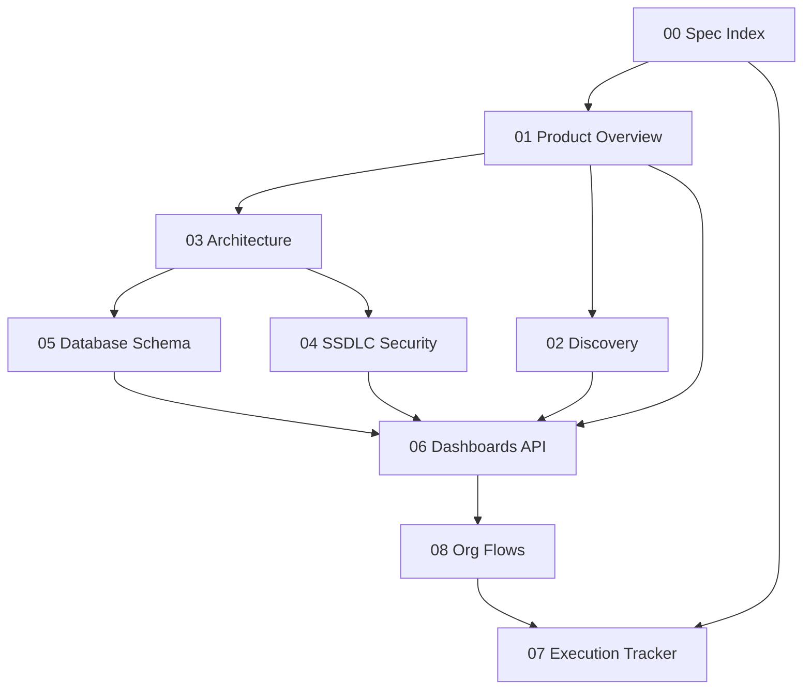

# QS Assets — Living Spec Index

| Field | Value |
|-------|-------|
| **Product** | QS Assets |
| **Vendor** | NeurQ AI Labs |
| **Spec wave** | Enterprise competitive build (Phase 0 living PRDs) |
| **Last reviewed** | 2026-07-13 |
| **Owners** | Product (NeurQ) · Platform Eng · Security |
| **Status** | Living — specs drive implementation |
| **Prior gap plan** | Historical Phases 1–5 complete (see [07-GAP-REMEDIATION-PLAN.md](07-GAP-REMEDIATION-PLAN.md)) |
| **Current tracker** | [07-GAP-REMEDIATION-PLAN.md](07-GAP-REMEDIATION-PLAN.md) Phases 1–10 |

---

## Purpose

These documents are the **authoritative product requirements** for QS Assets. Implementation must satisfy acceptance tests herein. Competitive inspiration (ManageEngine Suite, ServiceNow ITAM/EAM/CMDB/ITSM, Qualys CSAM/VMDR-lite, Ivanti Neurons, Asset Panda) is explicit; we ship working production-grade equivalents on our as-built stack — not pixel-perfect clones.

**Delivery principles**

1. Specs drive code — every Must-ship / In-build row has acceptance criteria.
2. No mocks — UI features hit real storage/APIs; missing deps show honest operational state.
3. Org lifecycle first — procure → discover → inventory → monitor → secure/patch → service → retire.
4. Scale defaults — Postgres indexes, batch jobs, Redis queues, pagination, tenant isolation (app filters + Postgres RLS).

---

## Document map

| # | File | Owner focus | Depends on | Status |
|---|------|-------------|------------|--------|
| 00 | [00-SPEC-INDEX.md](00-SPEC-INDEX.md) | Spec governance | — | Active |
| 01 | [01-PRODUCT-OVERVIEW.md](01-PRODUCT-OVERVIEW.md) | Module catalog + capability matrix | — | Living PRD |
| 02 | [02-DISCOVERY-AND-SCANNING.md](02-DISCOVERY-AND-SCANNING.md) | Agent, agentless, cloud, IoT, correlation | 01, 03 | Living PRD |
| 03 | [03-ARCHITECTURE-AND-TECH-STACK.md](03-ARCHITECTURE-AND-TECH-STACK.md) | As-built monorepo, deploy, tenancy | 01 | Living PRD |
| 04 | [04-SSDLC-COMPLIANCE-SECURITY.md](04-SSDLC-COMPLIANCE-SECURITY.md) | SSDLC, auth, audit, compliance | 03 | Living PRD |
| 05 | [05-DATABASE-SCHEMA.md](05-DATABASE-SCHEMA.md) | Prisma-aligned data model | 03 | Living PRD |
| 06 | [06-DASHBOARDS-API-DELIVERABLES.md](06-DASHBOARDS-API-DELIVERABLES.md) | Role UIs, REST catalog, checklists | 01–05 | Living PRD |
| 07 | [07-GAP-REMEDIATION-PLAN.md](07-GAP-REMEDIATION-PLAN.md) | Execution tracker (this wave) | 00–06, 08 | Active tracker |
| 08 | [08-ORG-FLOWS.md](08-ORG-FLOWS.md) | End-to-end org playbooks | 01–06 | Living PRD |

---

## Status vocabulary (capability matrices)

| Status | Meaning |
|--------|---------|
| **Shipped** | Present in as-built Nest/Next/Node agent codepaths; may need polish but demoable |
| **In-build** | Must-ship for this wave; tracked in [07](07-GAP-REMEDIATION-PLAN.md); no deferred “roadmap” language |
| **Future-only** | Explicitly out of this wave (Kafka, full Flow Designer canvas, Go agent rewrite, etc.) — labeled only when non-goals apply |

---

## Dependency / read order

1. Read **01** for what the product is and competitive Must-ship rows.
2. Read **03** for as-built stack (NestJS API, Next.js web, Node agent — not Go).
3. Read **02** / **05** / **04** for depth in discovery, data, and security.
4. Read **06** for routes/APIs and pass/fail deliverables.
5. Use **08** playbooks to validate org-scale flows.
6. Track work in **07**; mark rows Shipped when acceptance tests pass.

---

## As-built stack (summary)

| Layer | Technology |
|-------|------------|
| Monorepo | npm workspaces + Turborepo (`apps/*`, `packages/*`) |
| API | NestJS + Prisma + PostgreSQL (PostGIS image) |
| Web | Next.js App Router + Tailwind + Socket.io client |
| Agent | Node.js `agent/qs-discovery-agent.js` + Electron desktop (`apps/agent-desktop`) + MSI/PKG/DEB packaging |
| Realtime | In-process EventBus + Socket.io gateway |
| Jobs | Nest schedule + Redis/Bull where enabled |
| Local infra | `docker-compose.yml`: PostGIS, Redis, Meilisearch (+ optional Ollama) |
| Deploy targets | Railway (API), Vercel (web) |

---

## Review cadence

- Specs updated when schema, modules, or Must-ship status changes.
- After each tracker phase completes, update capability matrices in **01** and checklists in **06**.
- Do not edit the Cursor plan file; this `spec/` tree is the living source of truth.

---

## Explicit non-goals (this wave)

- Qualys proprietary vuln signature engine / ME full patch research lab.
- ServiceNow IntegrationHub-class general Flow Designer canvas.
- App-store notarization without customer code-signing certs (packaging scripts still ship).
- Rewriting the agent in Go (Node agent is permanent as-built unless a future ADR reverses it).
- Kafka/NATS as primary bus (Future-only; EventBus + Redis jobs are as-built).
