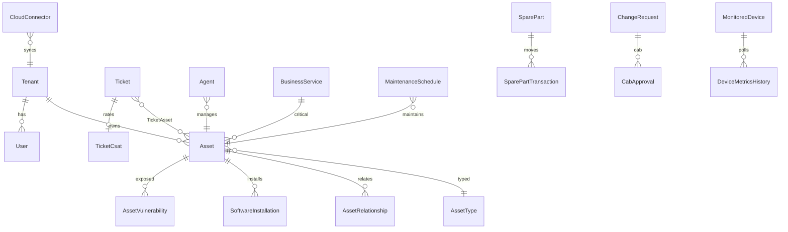

# QS Assets — Database Schema

| Field | Value |
|-------|-------|
| **Product** | QS Assets |
| **Last reviewed** | 2026-07-13 |
| **Status** | Living PRD |
| **Source of truth** | `apps/api/prisma/schema.prisma` + migrations |
| **Depends on** | [03](03-ARCHITECTURE-AND-TECH-STACK.md) |

> Specs describe intent and planned expansions. **Prisma wins** on field names, enums, and relations. After schema PRs merge, regenerate this doc’s “as-built” sections from Prisma.

---

## Design principles

1. UUID PKs; `tenant_id` on tenant-scoped tables.
2. Soft delete via `deleted_at` where lifecycle requires it (e.g. Asset).
3. JSON columns for extensible attributes (`customFields`, metrics, maps).
4. PostGIS available in Docker image; GPS stored as floats with raw SQL for geo queries as needed.
5. Indexes on tenant + lookup keys (IP, MAC, serial, hostname, status).
6. **RLS required** on tenant tables (In-build): policies using `current_setting('app.current_tenant')`.
7. Append-only audit with hash chain.

---

## As-built model catalog (Prisma)

### Tenant & auth

| Model | Purpose |
|-------|---------|
| `Tenant` | Org, plan (`STARTER`…`ON_PREMISE`), settings JSON |
| `Site` | Locations |
| `Department` | Org units / cost centers |
| `User` | Identity; `mfaEnabled`, `mfaSecret` |
| `Role` | RBAC |
| `RefreshToken` | Session refresh |
| `ApiKey` | Machine access |
| `AuditLog` | Hash-chained audit (`hash`, `prevHash`) |
| `SsoConfig` | SAML/OIDC/Google/Microsoft per tenant |
| `SystemConfig` | Platform knobs |
| `Subscription` / `Payment` | Billing |
| `ContactSubmission` | Marketing/contact |
| `UserTelemetry` | Product telemetry |

### CMDB / assets

| Model | Purpose |
|-------|---------|
| `AssetType` | Hierarchy; `isItAsset`; custom field schema |
| `Asset` | Unified CI — identity, location, finance, network, GPS, discovery |
| `AssetRelationship` | DEPENDS_ON, COMPONENT_OF, CONNECTED_TO, RUNS_ON, USED_BY, BACKUP_OF |
| `AssetHistory` | Lifecycle events |
| `HardwareDetail` / `OsDetail` / `SecurityPosture` | IT enrich |
| `AssetCheckout` | Loan / return |
| `AssetAttestation` | Owner certify campaigns |

**Enums (as-built):** `AssetStatus` (DISCOVERED…PENDING_REVIEW); `DiscoverySource` (AGENT, SNMP, WMI, SSH, NETWORK_SCAN, CLOUD*, ACTIVE_DIRECTORY, MANUAL, CSV_IMPORT, API, ONVIF, IOT, AGENTLESS).

### Software & licenses

| Model | Purpose |
|-------|---------|
| `SoftwareCatalog` | Normalized titles |
| `SoftwareInstallation` | Per-asset installs |
| `License` / `LicenseAssignment` | Entitlements |

### ITSM

| Model | Purpose |
|-------|---------|
| `Ticket` / `TicketComment` / `TicketAsset` | Incidents/requests |
| `WorkOrder` | Maintenance / field work |
| `SlaPolicy` | Timers |
| `ChangeRequest` | Changes |
| `Problem` | Problem mgmt |
| `KnowledgeArticle` | KB |
| `ServiceCatalogItem` | Requests |

### Discovery & monitoring

| Model | Purpose |
|-------|---------|
| `ScanJob` / `ScheduledScan` / `ScanCredential` / `ScanResult` | Scan orchestration |
| `DiscoveredDevice` | Pre-CMDB |
| `Agent` / `AgentBaseline` | Endpoint agents |
| `MonitoredDevice` | NMS/CCTV/VDI targets |
| `DeviceMetricsHistory` | SNMP time series |
| `NetworkConfig` | Config backup / hash |
| `EndpointPolicy` / `EndpointChange` | Compliance drift |
| `CloudConnector` | AWS/Azure (GCP In-build) |
| `MqttBrokerConfig` | IoT |

### Patch / vuln / alerts / NAC

| Model | Purpose |
|-------|---------|
| `Patch` / `PatchDeployment` | Patch ops |
| `Vulnerability` / `AssetVulnerability` | CVE / NVD |
| `AlertRule` / `AlertEvent` | Alerts |
| `NacVlanPolicy` / `NacNetworkSegment` / `NacRadiusConfig` | NAC |

### Automation / notify / reports

| Model | Purpose |
|-------|---------|
| `AutomationRule` / `AutomationExecution` | Rules engine |
| `ScriptLibrary` | Approved scripts |
| `Notification` / `NotificationChannel` | In-app + channels |
| `ScheduledReport` | Report schedules |

### Fleet

| Model | Purpose |
|-------|---------|
| `Trip` / `GpsTelemetry` | Fleet tracking |

### Procurement

| Model | Purpose |
|-------|---------|
| `Vendor` / `Contract` / `PurchaseOrder` / `PurchaseOrderItem` | Buy side |

---

## Planned expansions (Must-ship / In-build)

These models are **required** for enterprise parity. Add via Prisma migrations; then update this section to Shipped.

### EAM

```prisma
model MaintenanceSchedule {
  id            String   @id @default(uuid()) @db.Uuid
  tenantId      String   @map("tenant_id") @db.Uuid
  assetId       String   @map("asset_id") @db.Uuid
  name          String
  cadenceCron   String?  @map("cadence_cron")
  nextDueAt     DateTime? @map("next_due_at")
  conditionRule Json     @default("{}") @map("condition_rule")
  enabled       Boolean  @default(true)
  // ...
}

model MaintenanceWorkOrder {
  // links schedule → WorkOrder or embeds WO fields
}

model SparePart {
  id           String  @id @default(uuid()) @db.Uuid
  tenantId     String  @map("tenant_id") @db.Uuid
  sku          String
  name         String
  quantityOnHand Int   @map("quantity_on_hand")
  minStock     Int     @map("min_stock")
  // ...
}

model SparePartTransaction {
  // issue/receive against WO/asset
}

model Consumable {
  id           String @id @default(uuid()) @db.Uuid
  tenantId     String @map("tenant_id") @db.Uuid
  name         String
  quantity     Int
  reorderPoint Int    @map("reorder_point")
  // ...
}
```

**Site / Asset pins:** `Site.floorPlanUrl`; `Asset` customFields or columns `pinX`, `pinY` for overlay.

**RFID:** `Asset.rfidTag` (or barcode reuse) — lookup on `/scan`.

### CMDB CSDM-lite

```prisma
model BusinessService {
  id          String @id @default(uuid()) @db.Uuid
  tenantId    String @map("tenant_id") @db.Uuid
  name        String
  criticality String @default("MEDIUM")
  // relations to Asset via join table BusinessServiceAsset
}
```

### NMS flows

```prisma
model FlowRecord {
  id         String   @id @default(uuid()) @db.Uuid
  tenantId   String   @map("tenant_id") @db.Uuid
  exporterIp String   @map("exporter_ip")
  srcIp      String   @map("src_ip")
  dstIp      String   @map("dst_ip")
  bytes      BigInt
  packets    BigInt
  protocol   Int?
  collectedAt DateTime @map("collected_at")
  // + rollup tables as needed
}
```

Syslog events may use `AlertEvent` metadata or a dedicated `SyslogEvent` model.

### ITSM depth

```prisma
model CabApproval {
  id              String @id @default(uuid()) @db.Uuid
  tenantId        String @map("tenant_id") @db.Uuid
  changeRequestId String @map("change_request_id") @db.Uuid
  decision        String // APPROVED, REJECTED, DEFERRED
  decidedById     String? @map("decided_by_id") @db.Uuid
  decidedAt       DateTime?
  notes           String?
}

model TicketCsat {
  id        String @id @default(uuid()) @db.Uuid
  tenantId  String @map("tenant_id") @db.Uuid
  ticketId  String @map("ticket_id") @db.Uuid
  score     Int    // 1-5
  comment   String?
  createdAt DateTime @default(now())
}
```

SSDLC checklist fields may live on `ChangeRequest` JSON until normalized.

### Fleet geofence (if not JSON-only)

Optional `GeoFence` model: circular/polygon + alert wiring — or tenant settings JSON until volume justifies table.

---

## ER sketch (core)



---

## Migration policy

1. Never edit applied migrations; add new dated folders under `prisma/migrations/`.
2. Seed must remain idempotent for local + demo tenants.
3. After EAM/NetFlow/CAB models land, update capability rows in [01](01-PRODUCT-OVERVIEW.md) to Shipped.
4. RLS SQL may live in a migration or `infra/` — must run in prod before Enterprise launch.

---

## Acceptance tests — schema

1. `prisma validate` + `migrate deploy` clean on empty PostGIS DB.
2. Seed creates tenant, roles, sample assets, tickets.
3. Planned models exist and FK to tenant/asset; min-stock trigger path creates AlertEvent.
4. `BusinessService` health query returns aggregated child statuses.
5. `FlowRecord` insert from collector; top-talkers aggregate query returns within SLA on sample data.
6. `CabApproval` + `TicketCsat` round-trip via API.
7. RFID field indexed or unique per tenant for scan lookup.
8. Document stays aligned within one PR of Prisma changes.
